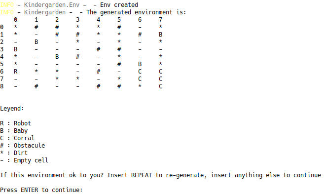
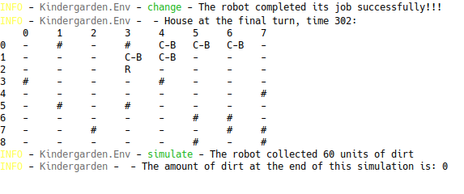

# Kindergarden

Agent-based-simulation project. This project simulates a house with some obstacules, dirt, a robot and several babies on the ground, all of which can generate dirt over time. The robot is an agent with the task of cleaning the house, and picking up the babies and leaving them in a corral. The environment can variate randomly every `t` units of time. Full specs and details about the environment, its elements and the robot are in spanish in the doc folder.

## Starting

To use the project, clone it or download it to your local computer.

### Requirements 📋

It is necessary to have `python v-3.7.2`

### Configure and run 🔧

To run the project, simply open the console from the root location of the project and execute:

```bash
python main.py
```

If you want to use the available parameters and thereby configurate the simulation, run the main script with the args listed by:

```bash
python main.py --help
```

Also, use the previous command to know how to pass the parameters.

To see what happens in every turn of the simulation, run the program with the `-i` or `--interactive` arg:

```bash
python main.py -i
```

The program will offers you instructions. Here a example of interactive simulation at the start and end of a simulation:

Start:



End:



Two types of agents were implemented: **Simple-reflex based agent** and **Goal-based agent**. By default the **Simple-reflex based** agent is used for the simulation. To simulate with the other, run the program with a the `-p` rule.

### Note

To run a suite of simulations, configure the sets of initial environments and the number of simulations in the `simulate.sh` script. Modify the `simulation` array to change the sets.

The results can be found in `results/results.json`. The data collected by a simulation is:

* Task completed by agent (`True` or `False`)
* Percentage of dirt at the end of this simulation

Check doc/Informe.pdf to see a full explanation of the ideas used to build the agents and the environment. The document is in Spanish.

## Author ✒️

- **Miguel Tenorio Potrony** -------> [stdevAntiD2ta](https://github.com/stdevAntiD2ta)

## License 📄

This project is under the License (MIT License) - see the file [LICENSE.md](LICENSE.md) for details.
